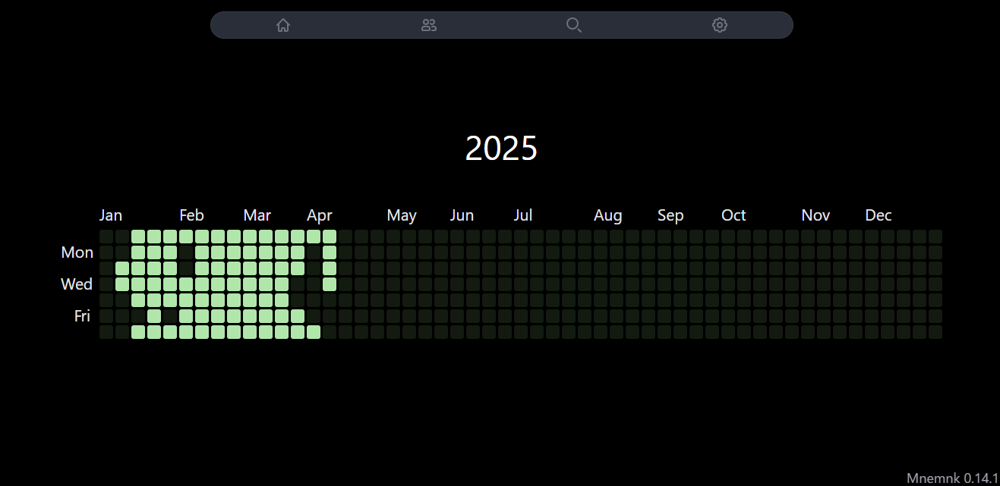
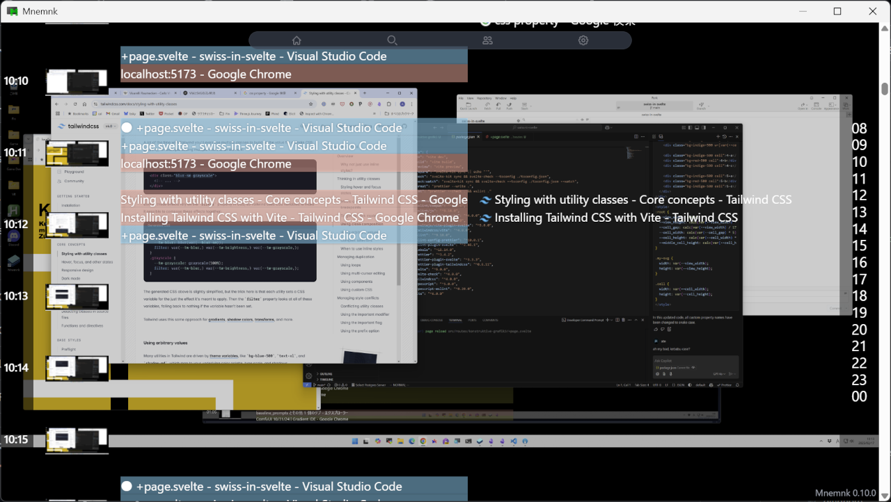
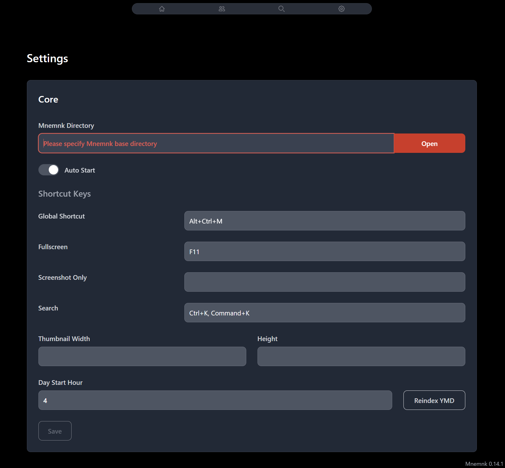

[ English | [日本語](README-ja.md) ]

 

 

![Badge Workflow]
![Badge Language] 
[![Badge License]][License] 

 

Mnemnk is a personal lifelogging platform that records your activities and enhances them through multi-agent systems.

 

## Features

### Automatic Activity Saving

Application usage history and browser history are automatically saved along with screenshots.

Saved information can be reviewed chronologically or searched.

### Privacy

- Activity records captured by this core system `mnemnk-app` and core agents are stored locally and never sent externally.
- The core system and core agents are published as open source software.

### Extensibility

- System extensibility is achieved by separating various functions as agents
- Agents can be developed in any programming language

## Installation

Download and run the installer from the [releases](https://github.com/mnemnk/mnemnk-app/releases) page.

### Core Agents

Please install each agent from their respective pages:

- [mnemnk-application](https://github.com/mnemnk/mnemnk-application): Saves application usage history
- [mnemnk-screen](https://github.com/mnemnk/mnemnk-screen): Saves screenshots
- [mnemnk-api](https://github.com/mnemnk/mnemnk-api): Provides API server
- [mnemnk-browser-extension](https://github.com/mnemnk/mnemnk-browser-extension): Communicates with `mnemnk-api` and saves browser history

## Configuration

You can start using the core with default settings.

For machines with multiple storages, you can change the storage location for the database and screenshots by specifying the Data Directory from the Settings page. Data is not moved automatically, so quit the application, copy the data, and then restart.

Agents can be enabled from the agent settings.

## Contribution

- Agent development
- Bug reporting
- Documentation improvement

<!----------------------------------------------------------------------------->

[License]: LICENSE

<!----------------------------------{ Badges }--------------------------------->

[Badge Workflow]: https://github.com/mnemnk/mnemnk-app/actions/workflows/publish.yml/badge.svg
[Badge Language]: https://img.shields.io/github/languages/top/mnemnk/mnemnk-app
[Badge License]: https://img.shields.io/github/license/mnemnk/mnemnk-app
